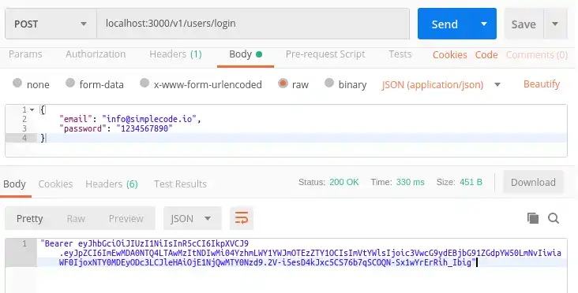
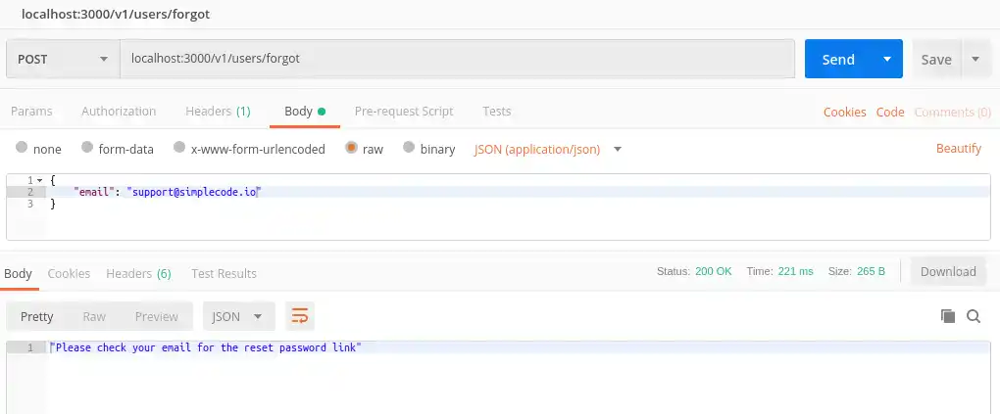
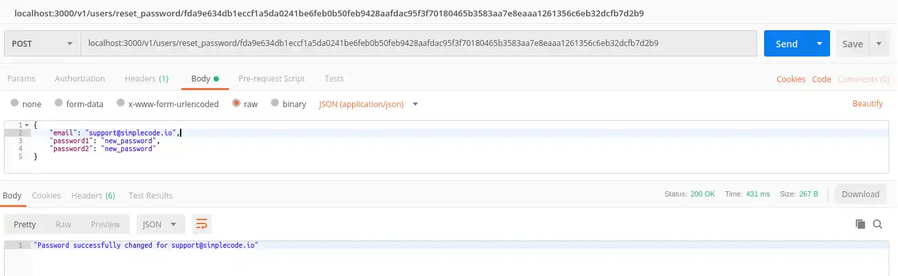
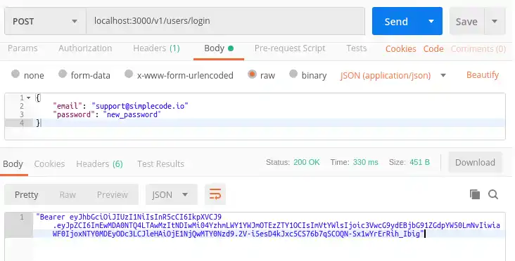

# Knex/Postgres/AuthServer

## Part 3

To test, with your server running, open up postman and enter 'localhost:3000/v1/users/register' in the address bar. Select 'Body' -> 'raw' and 'JSON(application/json)' and enter in the following json. Make sure request is `POST` type.

```json
{
  "email": "tim@example.com",
  "password1": "12345678",
  "password2": "12345678"
}
```

output:

```json
{
    "id": "23f9f36d-d84d-4c6a-adba-15361599792b",
    "email": "tim@example.com",
    "registered": "1570117000602",
    "token": "PJyHmRihz71Vi8OKTbRFqPjlEfmpbrY4DNtnOrFsIbC50kQjztczcOKUOxWqyttm"
}
```

## Part 4 - Sending email

For the example code to run, you have to:

```sh
export AWS_SDK_LOAD_CONFIG=true
```

Then your `./utilities/sendEmail.js` variables will log:

```js
console.log("Region: ", aws.config);
console.log("Region: ", aws.config.region);
console.log("accessKeyId: ", aws.config.credentials.accessKeyId);
console.log("secretAccessKey: ", aws.config.credentials.secretAccessKey);
```

## Part 5 - Verifying Tokens

With your server running, take the token that you received by email in part 4 of this series (everything after 'https://yourwebsite/v1/users/verify/') in
```sh
https://yourwebsite/v1/users/verify/tsMAvkMqaj0UlbnjLIjp8D6rbeM1i7l81Rg6FHnjOQTerG9FimWZPpjFpfCE7njJ
```

and add a new post request in Postman to your 'localhost:3000/v1/users/verify/:token' route. If everything is working you should get the following message back from your API:

```text
localhost:3000/v1/users/verify/tsMAvkMqaj0UlbnjLIjp8D6rbeM1i7l81Rg6FHnjOQTerG9FimWZPpjFpfCE7njJ
```

## Token Expiry Time

Creating tokens that never expire and sending them out over the internet is not very good for security. Let's create a `./utilities/tokenExpiry.js` file in the utilities folder to fix this.

`tokenExpiry.js` contains a function that runs every 4 seconds and checks the following:

- If an hour has passed after a user has registered through the API.
- If so, the token issued to the user at the time of registration is deleted from the database.

If token expired run `./validation/resend.js` which allows user to get a new token.

Test in postman. If the email address has been registered in the database but is not yet verified an 'Email re-sent!' message is returned (and a new token is sent):

```text
localhost:3000/v1/users/resend_email/

body: { "email":"nonverified_example@test.com"}
```

I changed the expiry to one minute but need to revisit. Not getting back email resent yet.

## Part 6 - using jsonwebtoken

Import `jwt` to `./api/routes/users.js`

```js
const jwt = require("jsonwebtoken");
```

### validation

When attempting to login a user should first pass some basic validation checks before we make a database request.

Create a new file called `login.js` in your `/validation` folder like below.
This is a little simpler than our registration validation in that we just check that users aren't sending an empty email or password before moving on to the next part of the route.

```js
const Validator = require("validator");
const ifEmpty = require("./checkForEmpty");

module.exports = function validateLoginInput(data) {
  let errors = {};

  data.email = !ifEmpty(data.email) ? data.email : "";
  data.password = !ifEmpty(data.password) ? data.password : "";

  if (!Validator.isEmail(data.email)) {
    errors.email = "Invalid email";
  }

  if (Validator.isEmpty(data.email)) {
    errors.email = "Email is required";
  }

  if (Validator.isEmpty(data.password)) {
    errors.password = "Password is required";
  }

  return {
    errors,
    isValid: ifEmpty(errors)
  };
};
```

### secret-key-file

To use the jsonwebtoken package in the next step, you need a way to sign your tokens with a key unqiue to your API. This key can be used later to verify that the token was indeed issued by you (and not a bad guy) when it is sent back by a user to access a secure route.

In your utilities folder, create a new file called keys.js with the following (replace "insert_random_string" with your own random string):

```js
module.exports = {
  secretOrKey: "my_random_string"
};
```

### Create the login route

In the `users.js` file, bring in your secret key and the validation function you just created:

```js
// simple-api/api/routes/users.js

// Secret key
const key = require("../../utilities/keys")
// Login validation
const validateLoginInput = require("../../validation/login");
```

Now start creating the route at the bottom of users.js (Not below module.exports of course) with your validation function:

```js
// Login route
router.post('/login', (req, res) => {
    // Ensures that all entries by the user are valid
    const { errors, isValid } = validateLoginInput(req.body);

    if (!isValid) {
        return res.status(400).json(errors);
    }
    else {
```

And add a database call that selects id, email and password if the email in the database matches the email being used to login and only if they have verified their email:

```js
database
.select('id', 'email', 'password')
.where('email', '=', req.body.email)
.andWhere('emailverified', true)
.from('users')
.then((data) => {
        ```
/* In the .then of the database call, we use a bcrypt function called compare to compare the password your user is attempting to log in with to the hashed password in your database: */
```js

bcrypt.compare(req.body.password, data[0].password).then((isMatch) => {
if (isMatch) {
/* If the passwords match, we use jsonwebtoken's sign function to create a signed token using or secret key and set it to expire after 1 hour (use a lower number for even better security): */

const payload = { id: data[0].id, email: data[0].email };
jwt.sign(payload, key.secretOrKey, { expiresIn: 3600 }, (err, token) => {
              ```
/* This payload contains a users id and email. You can send anything you want in the payload but it is not recommended to send the password.

Finally return the token with status 200 else return status 400 with a "Bad request" message */
```js
res.status(200).json('Bearer ' + token);
});
}
else {
res.status(400).json('Bad request');
}
});
})
.catch((err) => {
res.status(400).json('Bad request');
});
}
});
```

### testing login route

Create and verify a new user.

Then in postman  hit the login route with the email and password.



## Part 7 - Forgot / Reset Password Routes

### Database Setup

You are going to need 3 new columns. You could delete and rebuild everything from scratch or you could alter your existing database and add the columns to it. Rebuilding the database is as simple as droping it and running the new schema. We will run through the altering method here.

### Alter Table

In `postico` in `simple_api` db, click `sqlQuery` icon and run this query:

```sql
ALTER TABLE users
    ADD reset_password_token VARCHAR(128) UNIQUE,
    ADD reset_password_expires BIGINT,
    ADD reset_password_token_used BOOLEAN;
```

### Creating the Forgot Password Route

We will `checkEmail.js` in our forgot password route to check if the user is using a valid email address.

```js

// simple-api/validation/checkEmail.js

const Validator = require("validator");
const ifEmpty = require("./checkForEmpty");

module.exports = function validateResetInput(data) {
  let errors = {};

  data.email = !ifEmpty(data.email) ? data.email : "";

  if (Validator.isEmpty(data.email)) {
    errors.email = "Email is required";
  }
  if (!Validator.isEmail(data.email)) {
    errors.email = " Email is invalid";
  }
  return {
    errors,
    isValid: ifEmpty(errors)
  };
};
```

### The Forgot Password Route

At the top of `api/routes/users.js`, import your new email validator:
`const validateResetInput = require("../../validation/checkEmail");`

See notes in `./api/routes/users.js` `forgot` route.

### Creating the Reset Password Route

So now that your user has a reset token in their email, what do they do with it? Well they need to send it back, confirming that they are the owner of that email address. Next you'll add a route to do this with a little more validation.

### Some More Validation

We are going to have our user enter a new password (Because they forgot their old one right?). So create a new file called `newPassword.js` in your validation folder to check that their new password is a good one. See `validation/newPassword.js`.

### The Reset Password Route

Back in `api/routes/users.js`, import your new password validator and create another route to reset the password:

By now [`./api/routes/users.js`](./api/routes/users.js) should look quite familiar as it is a mixture of some of our other routes. What is going on here:

1. The route takes a token as a parameter

2. Check that the token exists and has not been used before

3. If token is good, validate the new password

4. If pasword is valid, update the password for the user associated with the token

5. Send an email to the user telling them about their password change.

### Automatic Token Expiry

Let's add a little extra security to our API and make sure our reset tokens are automatically removed from our database after a set period of time. Add the following function to the [`./utilities/tokenExpiry.js`](./utilities/tokenExpiry.js). Removes reset password tokens older than one hour so if the user doesn't use the reset password token within an hour we cancel it.

```js
setInterval(async function checkPasswordTokenValidity() {
  await database
    .select("id", "reset_password_expires")
    .from("users")
    .then(tokenExpiry => {
      if (tokenExpiry) {
        tokenExpiry.map(resetTime => {
          let timeInInt = parseInt(resetTime.reset_password_expires);
          if (Date.now() > timeInInt + 60000 * 60) {
            database
              .table("users")
              .where("id", resetTime.id)
              .update({ reset_password_token: null })
              .then(res => res)
              .catch(err => err);
          }
        });
      }
    })
    .catch(err => console.log(err));
}, 6000);
```

### Test it out with postman

Now let's make sure it all works. First make a post request to your new /forgot route using an email that is already registered. You should see something like this:



Now using the token that was emailed to you (or you can grab it right from your users table in your database) make a post request to `/reset_password/:token`



If you try to enter your user's old password in postman, you should see a "bad request" message because that isn't their password anymore. Enter the new password and you should see:



